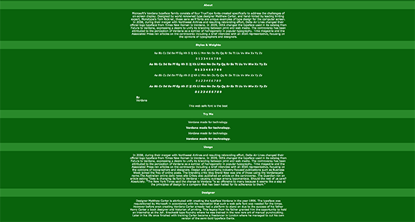
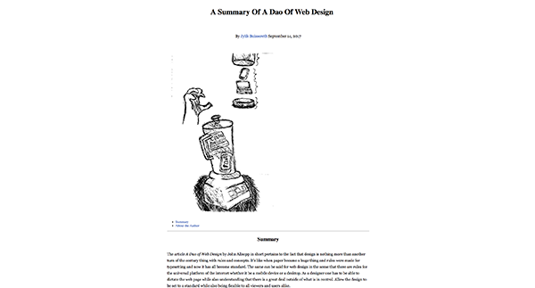

# Web-Test
<!DOCTYPE html>
<html dir="ltr" lang="en-us">
<head>
    <meta charset="utf-8">
    <link rel="stylesheet" href="css/main.css">
	<title>Web Test</title>
	<meta name="author" content="Jylik Buissereth" />
</head>
<body>

<header id="banner">
  <h1>Semester Review</h1>
  
  </header>

<h2>Verdana</h2>

A simple page meant to give a quick history and background to the typeface Verdana. The
page is tailored to showcase the typefaces style and weights, its usage and a small section
that talks about the designer. There is also a section called try me that acts as a test for 
a user to test the typeface and its style and wights with any phrase they choose.

<figure id="fig-1">

</figure>

<a href="https://jbuissereth.github.io/Verdana/">Verdana Type Specimen</a>

<h2>Ebb & Flow</h2>

This page was dedicated to acting as an extended summary of an article titled A Dao of
Web Design. It's contents include a small persona summary of the article accompanied with 
quotes, a link to the original article and sketches interpreted from the articles content.

<figure id="fig-2">

</figure>

<a href="https://jbuissereth.github.io/markdown-demo/">Summary of A Dao of Web Design</a>

<h2>Final</h2>

A single serve site created around the number 13. The page has three sections, one for 
the history of the number as well as a section for its place in religion. The final section 
of the page talks of all the superstitions that surround the accursed number.

<figure id="fig-3">

</figure>

<a href="https://jbuissereth.github.io/Final/.">Thirteen</a>

</body>
</html>
